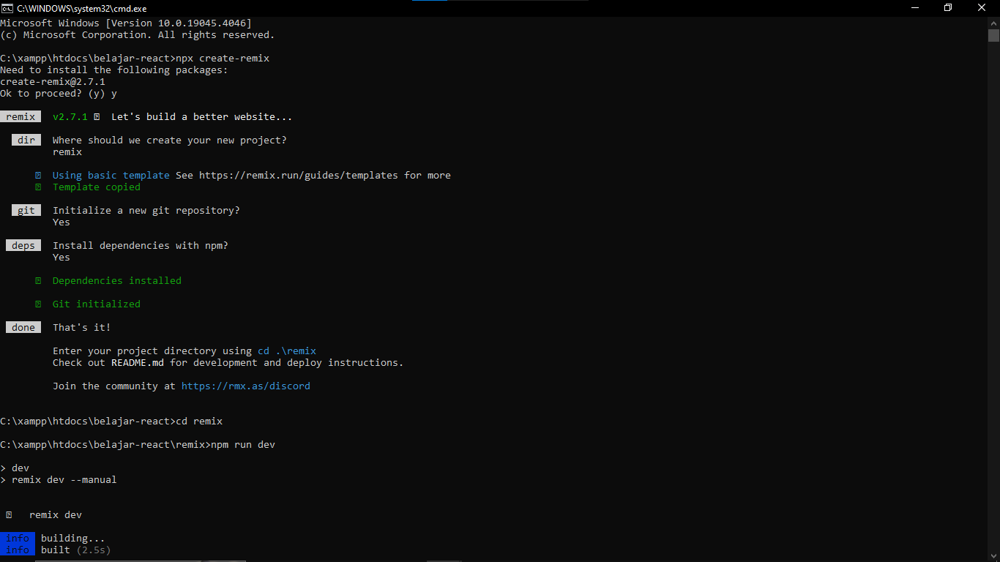
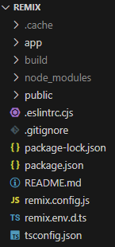
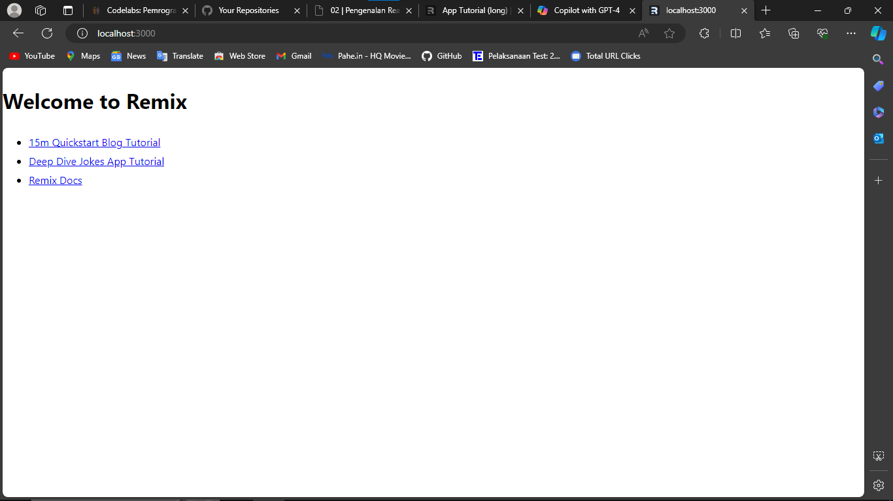
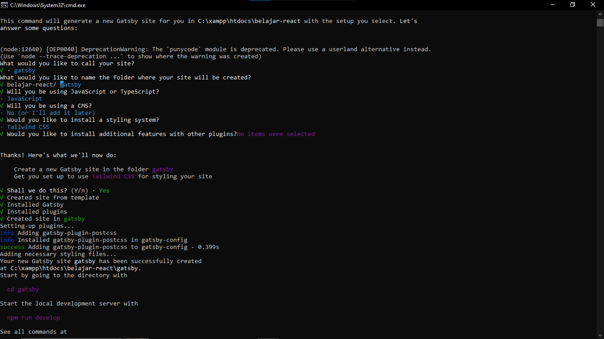
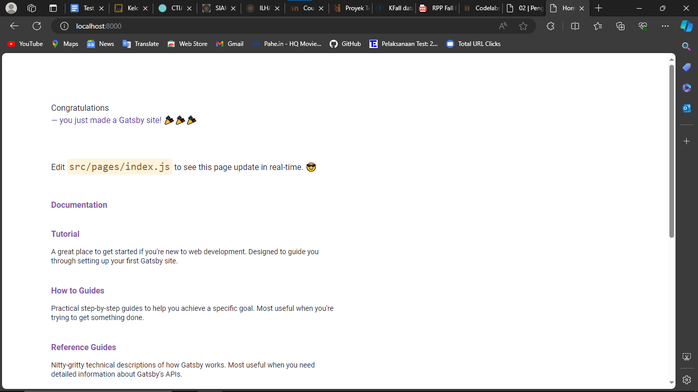
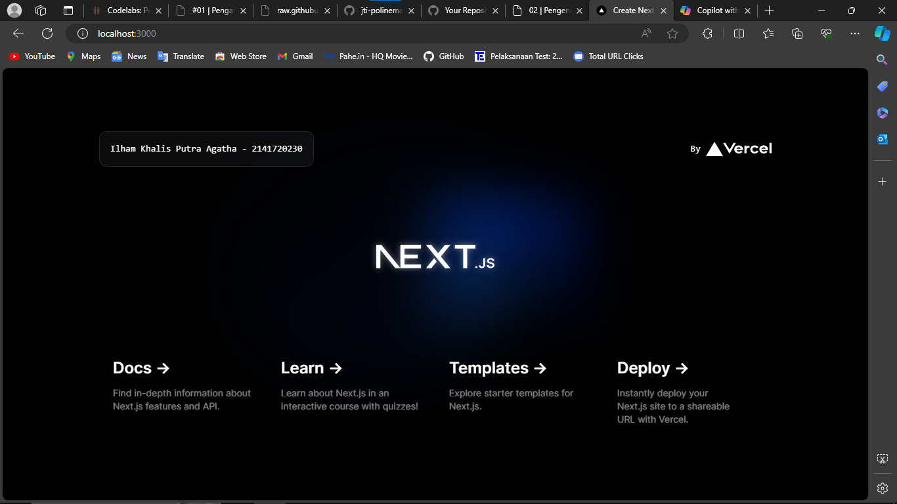
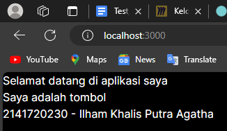
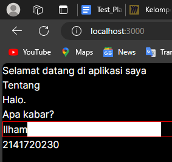
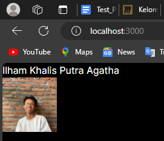

This is a [Next.js](https://nextjs.org/) project bootstrapped with [`create-next-app`](https://github.com/vercel/next.js/tree/canary/packages/create-next-app).

## Getting Started

First, run the development server:

```bash
npm run dev
# or
yarn dev
# or
pnpm dev
# or
bun dev
```

Open [http://localhost:3000](http://localhost:3000) with your browser to see the result.

You can start editing the page by modifying `app/page.tsx`. The page auto-updates as you edit the file.

This project uses [`next/font`](https://nextjs.org/docs/basic-features/font-optimization) to automatically optimize and load Inter, a custom Google Font.

## Learn More

To learn more about Next.js, take a look at the following resources:

- [Next.js Documentation](https://nextjs.org/docs) - learn about Next.js features and API.
- [Learn Next.js](https://nextjs.org/learn) - an interactive Next.js tutorial.

You can check out [the Next.js GitHub repository](https://github.com/vercel/next.js/) - your feedback and contributions are welcome!

## Deploy on Vercel

The easiest way to deploy your Next.js app is to use the [Vercel Platform](https://vercel.com/new?utm_medium=default-template&filter=next.js&utm_source=create-next-app&utm_campaign=create-next-app-readme) from the creators of Next.js.

Check out our [Next.js deployment documentation](https://nextjs.org/docs/deployment) for more details.

## Laporan Praktikum

|  | Pemrograman Berbasis Framework 2024 |
|--|--|
| NIM |  2141720230 |
| Nama |  Ilham Khalis Putra Agatha |
| Kelas | TI - 3A |


### Jawaban Soal 1

Pada gambar tersebut, silakan Anda browsing apa yang dimaksud dengan:

TypeScript
ESLint
Tailwind CSS
App Router
Import alias

Berikut adalah penjelasan singkat tentang istilah-istilah di atas:

TypeScript: TypeScript adalah bahasa pemrograman yang kuat dan berjenis kuat yang dibangun di atas JavaScript, memberikan alat yang lebih baik pada skala apa pun. TypeScript menambahkan sintaks tambahan ke JavaScript untuk mendukung integrasi yang lebih erat dengan editor.
ESLint: ESLint adalah proyek open source yang membantu menemukan dan memperbaiki masalah dengan kode JavaScript. ESLint dibangun ke dalam sebagian besar editor teks dan dapat menjalankan ESLint sebagai bagian dari pipeline integrasi berkelanjutan.
Tailwind CSS: Tailwind CSS memungkinkan membangun desain apa pun, langsung di HTML, dengan kelas seperti flex, pt-4, text-center, dan rotate-903. Lihat bagaimana skala pada tim besar, beradaptasi dengan desain apa pun, dan mengurangi ukuran build.
App Router: App Router di Next.js memperkenalkan model baru untuk membangun aplikasi menggunakan fitur terbaru React seperti Server Components, Streaming with Suspense, dan Server Actions4. App Router bekerja dalam direktori baru bernama app.
Import alias: Alias impor adalah di mana mengambil impor standar, tetapi bukan menggunakan nama yang ditentukan sebelumnya oleh modul yang mengekspor, menggunakan nama yang ditentukan dalam modul yang mengimpor.

Remix





Gatsby





Perbedaan terdapat pada cara penginstallan, nama file, dan tampilan awal

### Jawaban Soal 2

Pada struktur project tersebut, jelaskan kegunaan folder dan file masing-masing tersebut!

Berikut adalah penjelasan tentang kegunaan folder dan file pada struktur proyek yang Anda tunjukkan:

.git: Folder ini digunakan oleh Git untuk kontrol versi. Folder ini menyimpan metadata dan database objek untuk proyek.
node_modules: Berisi semua paket dan modul yang diinstal melalui npm, termasuk dependensinya.
public: Biasanya berisi file statis yang dapat diakses secara publik, seperti gambar, stylesheet, atau script.
src: Folder sumber di mana kode utama aplikasi berada. Biasanya berisi komponen, aset, dan file kode lainnya.
.eslintrc.json: File konfigurasi untuk ESLint, alat untuk mengidentifikasi dan memperbaiki masalah dalam kode JavaScript.
.gitignore: Mendaftar file dan direktori yang diabaikan oleh Git; mereka tidak akan dilacak atau ditambahkan ke sistem kontrol versi.
next.config.mjs & next-env.d.ts: File konfigurasi terkait pengaturan kerangka kerja Next.js dan tipe lingkungan masing-masing.
package.json & package-lock.json: Berisi metadata tentang proyek dan dependensi; package-lock memastikan versi dependensi tetap konsisten di semua lingkungan.
postcss.config.js: File konfigurasi untuk alat pemrosesan PostCSS yang digunakan dalam mengubah gaya CSS dengan plugin JavaScript.
README.md: File markdown yang berisi informasi tentang proyek seperti deskripsi, instruksi pengaturan, dll.
tailwind.config.ts: File konfigurasi Tailwind CSS untuk menyesuaikan berbagai aspek konfigurasi default Tailwind termasuk warna, spasi, dll.
tsconfig.json: Konfigurasi untuk kompiler TypeScript dengan pengaturan yang mendefinisikan bagaimana TypeScript harus dikonversi menjadi JavaScript.

### Jawaban Soal 3

Gantilah teks pada bagian atas dengan Nama - NIM Anda. Contoh seperti gambar berikut:



Jawaban dibuktikan dengan hasil screenshot.

Ketika Anda telah berhasil mengganti teks tersebut, Anda tidak perlu menjalankan perintah npm run dev dan tidak juga diperlukan me-reload halaman di browser. Tiba-tiba perubahan itu tampil, Mengapa terjadi demikian? Jelaskan!

Hal ini disebabkan oleh fitur yang disebut Hot Module Replacement (HMR) atau Hot Reloading. Fitur ini memungkinkan untuk melihat perubahan yang telah dibuat dalam kode tanpa harus memuat ulang seluruh aplikasi.

### Jawaban Soal 4

Buatlah komponen MyTextNimName() berdasarkan kode dari soal nomor 3 sebelumnya. Lalu panggillah komponen tersebut. Apakah ada perubahan tampilan ? Mengapa demikian ?

Terdapat perubahan tampilan dengan ditambahnya nim dan nama.


### Jawaban Soal 5

Buatlah komponen MyPage() berdasarkan project praktikum 1 ini yang berisi kode-kode HTML dari fungsi Home(). Lalu panggillah komponen tersebut. Apakah ada perubahan tampilan ? Mengapa demikian ?



### Jawaban Soal 6

Gunakanlah Kode JSX image tersebut, ganti dengan NIM, Nama Anda beserta link gambar ganti dengan foto Anda (bisa dari link medsos atau lainnya). Push codenya dan screenshot hasilnya.

